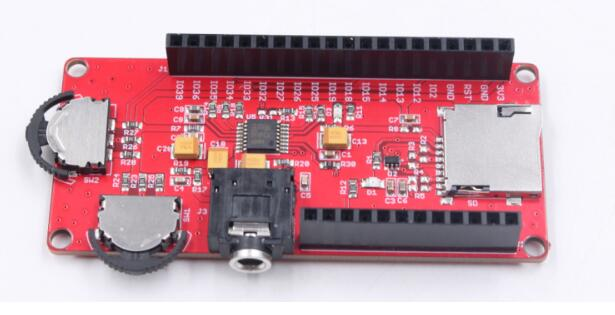
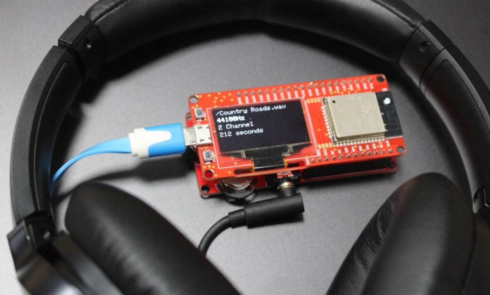
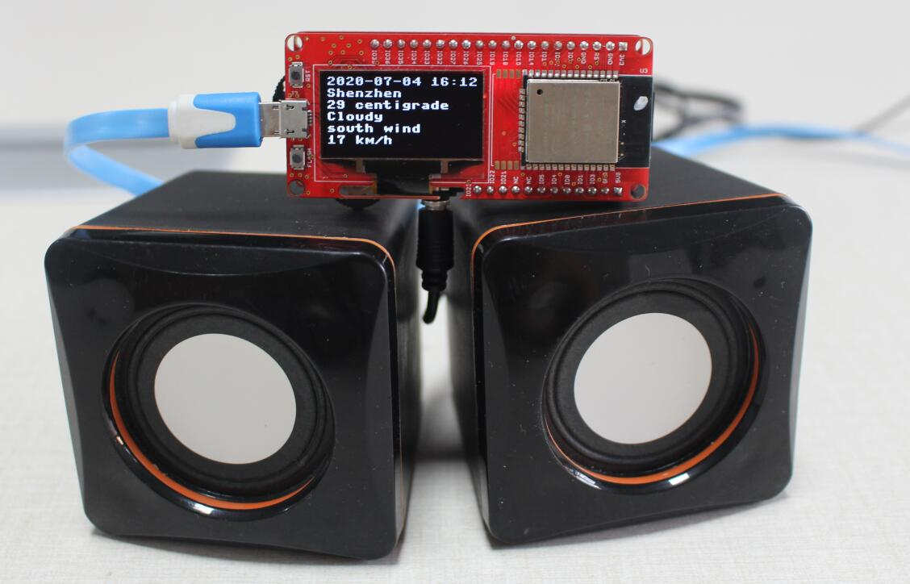

# MakerPython-Audio

```c++
/*
Version:		V2.0
Author:			UNKOWN
Create Date:	UNKOWN
Note:
	2020/7/24	v2.0: Rebuid readme,add pic. By Vincent
*/
```

[toc]

# Introduce

The MakePython Audio board uses the uDA1334 digital to analog converter (DAC), which converts I2S (not be confused with I2C) audio to an analog signal to drive speakers. The I2S Audioboard converts the digital audio signals using the I2S standard to an analog signal.



- You can get one from: [MakePython_Audio](https://www.makerfabs.com/makepython-audio.html)

- Hardware and detailed instructions please visit Wiki page:  [MakePython_Audio Wiki](https://www.makerfabs.com/wiki/index.php?title=MakePython_Audio)

# Related Projects

## [Project_MakePython_Audio_Music](https://github.com/Makerfabs/Project_MakePython_Audio_Music)

- Make a music player by yourself.
- [YOUTUBE:MakePython Audio Music Play](https://www.youtube.com/watch?v=0urJ_uxfW0k&feature=youtu.be)



## [Project_TTS-Weather-Broadcast](https://github.com/Makerfabs/Project_TTS-Weather-Broadcast)

- Internet weather voice broadcast by TTS(Text to Speech).
- [YOUTUBE:TTS-Weather-Broadcast](https://youtu.be/00nAEQKYFV4)


